# 2D Visual Design & Surface Materiality (Exploration Notes & Scratchpad)

> [!NOTE]
> **Exploration Scratchpad:** This document synthesises the exploratory visual studies, material matrix experiments, and visual design iterations for the 2D interface.
> The **authoritative specifications** for layout, tokens, and component contracts are:
> - **[`docs/ui-paradigm-exploration.md`](./ui-paradigm-exploration.md)** (Spatial architecture, console modes, and responsive detents)
> - **[`docs/ui-visual-language.md`](./ui-visual-language.md)** (Semantic tokens, tabular data typography, and HTML `data-*` CUBE exceptions)
> - **[`docs/design-system.md`](./design-system.md)** (Core design system foundations and token hierarchy)

---

## 1. Exploration Journey & Aesthetic Matrices

To establish a cohesive visual language balancing scientific rigour with modern 3D web immersion, we evaluated three distinct visual paradigms across docked and floating configurations:

### Matrix A: Atmospheric Dark Sci-Fi
* **Characteristics:** Deep celestial tones, glowing cyan and amber vector lines, cinematic lighting washes, and expansive dark canvases.
* **Visual References:**
  * 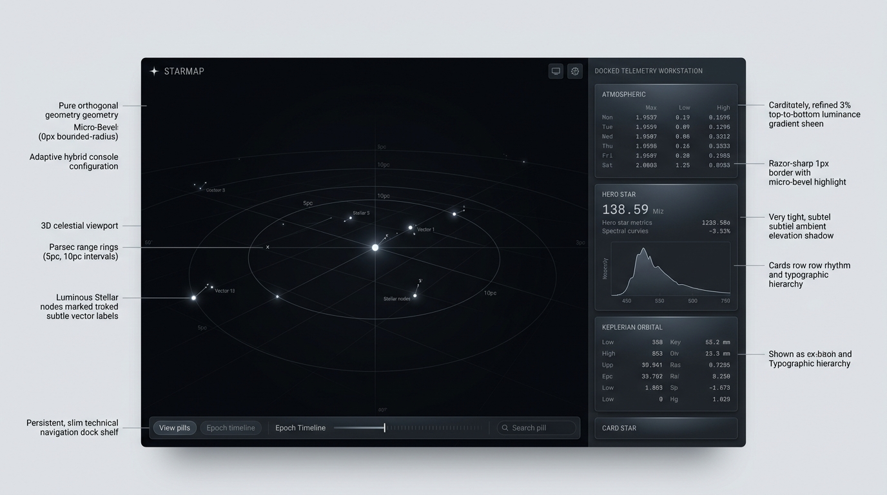
  * 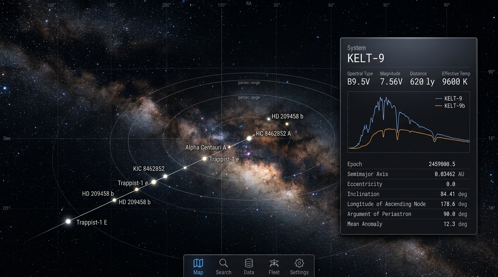
  * 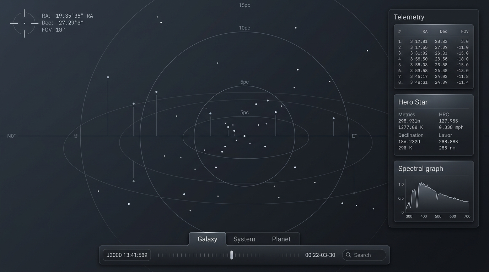
* **Critical Evaluation:** Highly evocative and immersive. However, unconstrained neon glows and heavy ambient washes degrade textual contrast and induce visual fatigue when parsing dense astronomical catalogues.

### Matrix B: Tactical Instrument Console
* **Characteristics:** High-density tabular layout, military/scientific flight deck ethos, monochromatic matte graphite surfaces, and monospaced data grids.
* **Visual References:**
  * 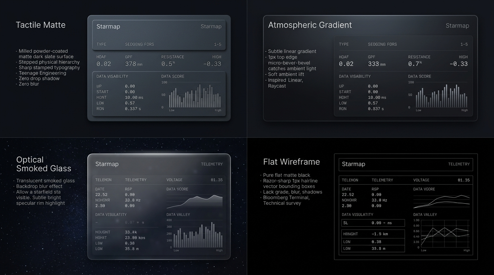
  * 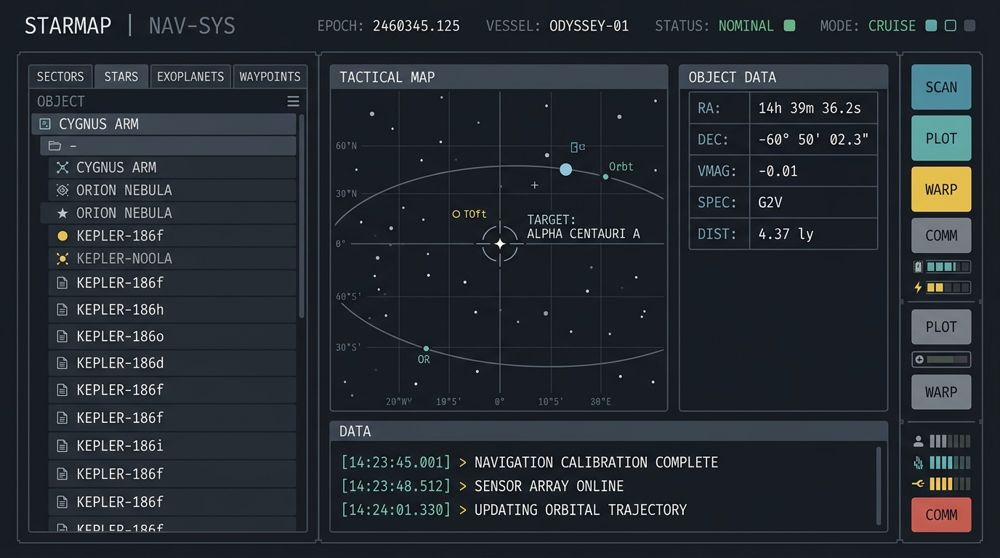
  * 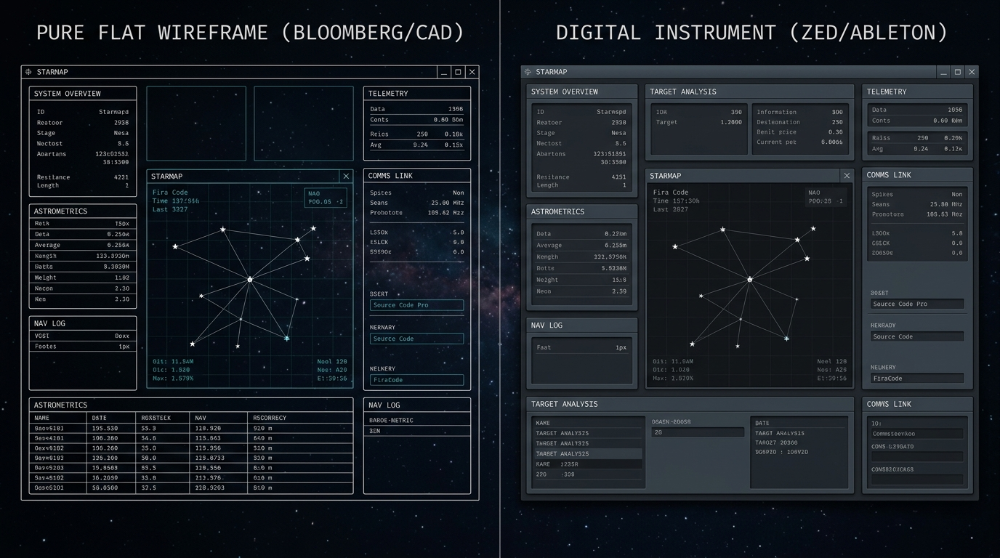
  * 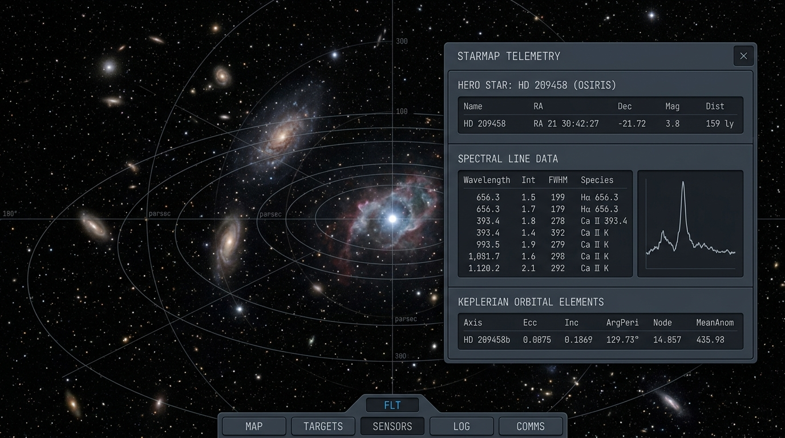
  * 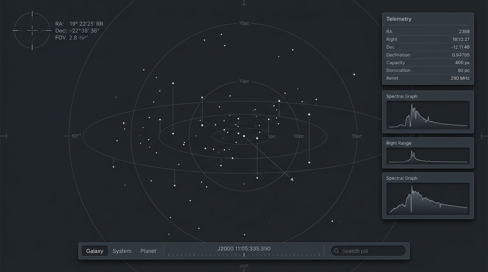
* **Critical Evaluation:** Exceptional clarity, zero visual distractions, and maximum data throughput. Lacked spatial separation when superimposed over 3D starfields without subtle depth and lighting cues.

### Matrix C: Optical Frosted Glass (Translucent HUD)
* **Characteristics:** Extensive backdrop blur (`backdrop-filter: blur(...)`), translucent surfaces, modern glassmorphism.
* **Visual References:**
  * 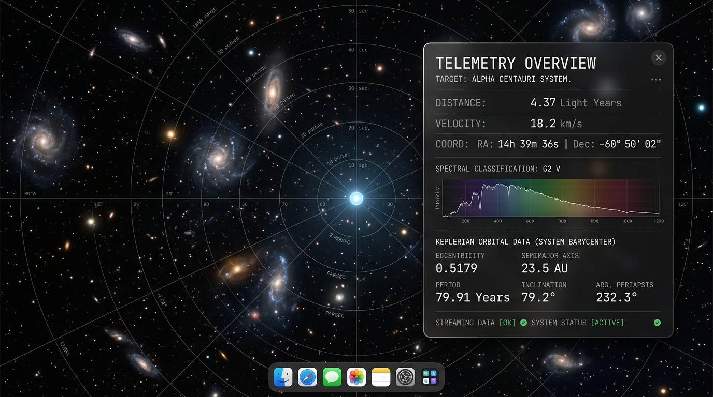
  * 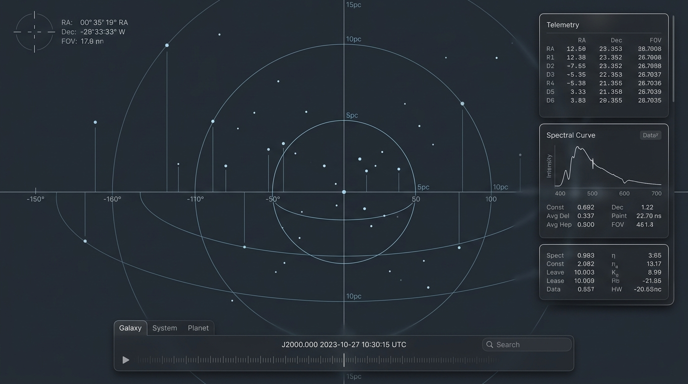
* **Critical Evaluation:** Elegant in isolation, but fundamentally flawed over dynamic 3D starfields. High-frequency star noise churning behind translucent panels rendered tabular metrics unreadable.

---

## 2. Core Optical & Materiality Principles (The Agreed Synthesis)

By combining the strengths of the three matrices and eliminating their defects, we ratified three foundational optical rules:

### Principle 1: The Selective Glass Principle
* **Rule:** Translucent smoked optical glass with backdrop blur is **strictly quarantined to transient, floating in-situ overlays** (e.g. contextual tooltips hovering over stars in the 3D scene, flyout menus, and the command palette dimming wash).
* **Structural Isolation:** All primary structural containers (the persistent dock, telemetry container, split bays, and drawers) are **100% solid, opaque micro-matte graphite slabs**. This ensures 100% textual contrast regardless of what passes behind them in the 3D viewport.
* **Visual Reference:**
  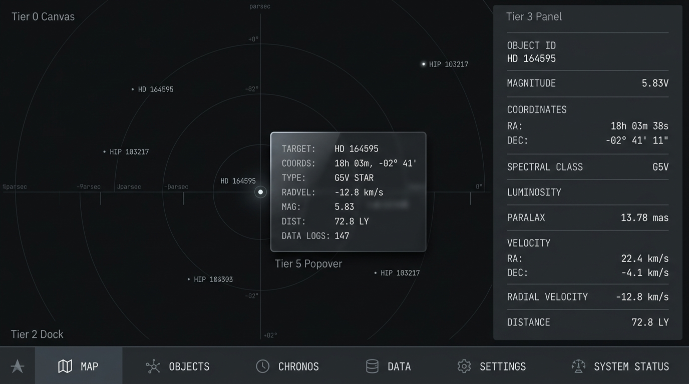

### Principle 2: Directional Micro-Bevel Discipline
* **Rule:** To evoke physical precision milling without skeuomorphic clutter, elevated structural containers receive a subtle **1px top-rim specular light catch** (`--palette-white-alpha-12` to `alpha-16`).
* **Boundary Discipline:**
  * Strictly applied to the top horizontal rim of elevated containers, modals, and the coplanar dock boundary divider.
  * Strictly excluded from bottom and side edges (which receive soft ambient drop shadows).
  * Strictly excluded from internal divider rules, which remain flat, quiet hairlines (`--border-subtle`).
* **Visual Reference:**
  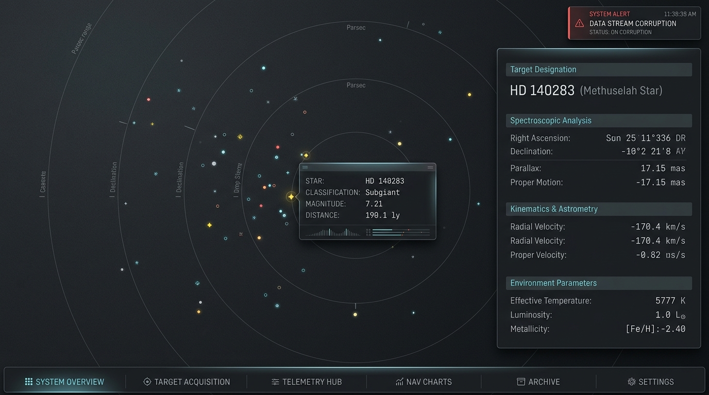

### Principle 3: Micro-Matte Graphite Materiality
* **Rule:** Base surfaces employ a deep slate/graphite tone (`#0B0E14` to `#12161F`) featuring a subtle micro-grain / anodised texture that catches specular rim highlights while preventing specular glare over dense text.
* **Visual Reference:**
  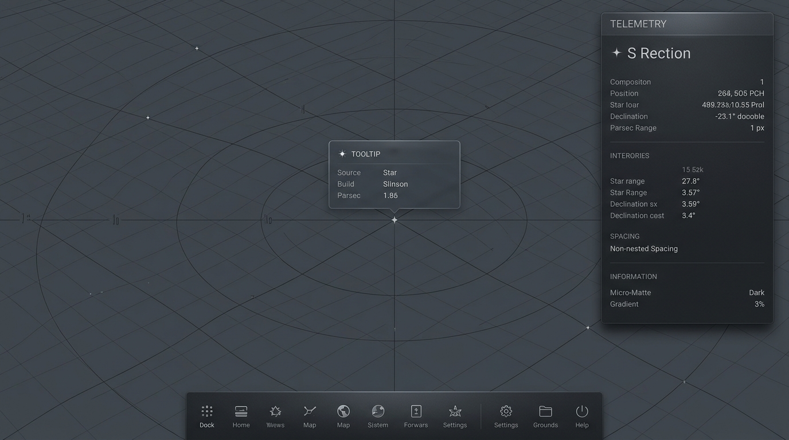

---

## 3. The 8-Tier Elevation Stack

The spatial depth of the 2D interface is structured into an explicit 8-tier elevation system, ensuring unambiguous visual hierarchy from the 3D scene floor to transient system alerts.

* **Visual References:**
  * 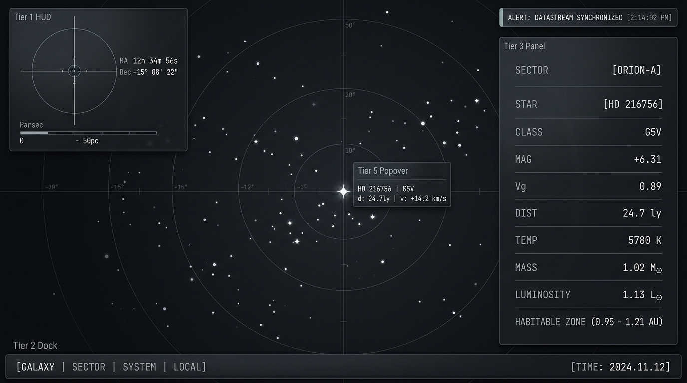
  * 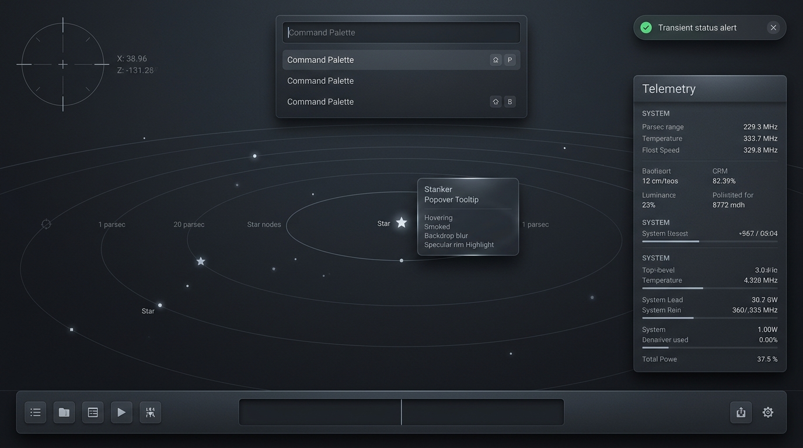

### Elevation Matrix

| Tier | Component / Surface | Plane ($Z$) | Optical Treatment | Lighting & Border Treatment |
| :--- | :--- | :---: | :--- | :--- |
| **Tier 0** | **3D Canvas Floor** | 0 | Deep cartographic space; coordinate lines and stellar nodes. | N/A (coordinate lines only) |
| **Tier 1** | **Reticle HUD** | 1 | Pure vector lines rendered directly on the canvas; 100% transparent fill. | 1px vector hairlines |
| **Tier 2** | **Persistent Dock** | 2 | Coplanar with canvas; solid micro-matte dark slate. | 1px hairline divider with subtle top light catch |
| **Nested** | **Scrubber Well** | Inset | Sunken base tone (`--surface-inset`) for timeline scrubbing channels. | Inset mechanical channel boundary, darker base tone |
| **Tier 3/4**| **Telemetry Panel** | 3 / 4 | Monolithic textured graphite slab elevated over canvas. | 1px top-rim micro-bevel + ambient drop shadow |
| **Tier 5** | **Context Tooltip** | 5 | Optical smoked glass hovering in-situ over celestial targets. | Active backdrop blur + 1px specular rim highlight |
| **Tier 6** | **Command Palette** | 6 | Monolithic high-elevation modal box over backdrop wash. | 1px micro-bevel top highlight + deep elevation shadow |
| **Tier 7** | **System Toast** | 7 | Transient high-priority status alert chip; highest z-index. | 1px perimeter boundary + crisp drop shadow |

---

## 4. Geometry, Layout & Typographic Disciplines

### Strict Orthogonal Geometry
* **Zero Rounded Corners:** All containers, buttons, chips, and modals enforce `--radius-none: 0px`. Rounding introduces visual softness inconsistent with precision scientific instrumentation.
* **Razor-Sharp Hairlines:** Borders are clamped to 1px screen-space hairlines (`--border-subtle`, `--border-default`).

### Expansive, Non-Nested Planes
* **Anti-Clutter Principle:** Elimination of "boxes inside boxes". Telemetry panels are expansive, continuous monolithic slabs.
* **Hairline Dividers:** Internal grouping relies on generous Fibonacci row rhythm and flat, single-line horizontal rules rather than nested border boxes.

### Tabular Numerical Rigour
* **Monospace Alignment:** All numerical telemetry columns enforce `font-variant-numeric: tabular-nums` to guarantee vertical digit alignment during live data streaming.
* **Layout Alignment:** Numeric metrics right-aligned; labels and keys left-aligned; units subordinated in lower contrast.

### Chromatic Economy
* **Achromatic Baseline:** Backgrounds and structural chrome remain strictly achromatic or near-neutral deep graphite (`#0B0E14` – `#1A1F2C`).
* **Chromatic Exclusivity:** Saturated colours are strictly reserved for:
  1. Semantic status tokens (`--status-nominal`, `--status-warning`, `--status-critical`).
  2. Observational confidence tokens (`--confidence-confirmed`, `--confidence-candidate`, `--confidence-unverified`).
  3. Active search and query filtering highlights.

---

## 5. Relationship to Downstream Specifications

1. **[`docs/ui-paradigm-exploration.md`](./ui-paradigm-exploration.md):** Governs the spatial ergonomics of the Adaptive Hybrid Console, viewport bounds adjustments in docked mode, and stepped mobile detents.
2. **[`docs/ui-visual-language.md`](./ui-visual-language.md):** Codifies the tokens, contrast ratios, and CUBE exception architecture (`data-status`, `data-confidence`, `data-elevation`) implementing these visual rules in code.
3. **[`docs/3d-spatial-architecture.md`](./3d-spatial-architecture.md):** Defines the corresponding 3D reticles, coordinate graticules, and focal aperture in the WebGL viewport.
