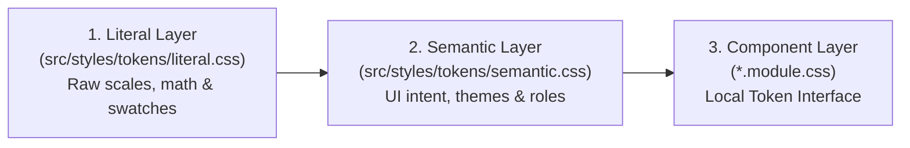
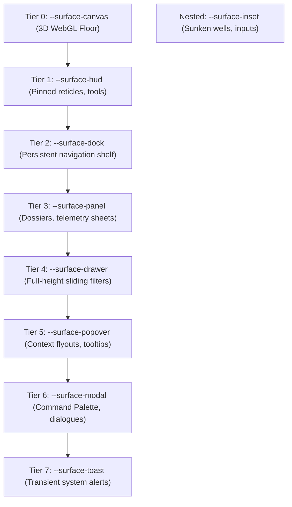
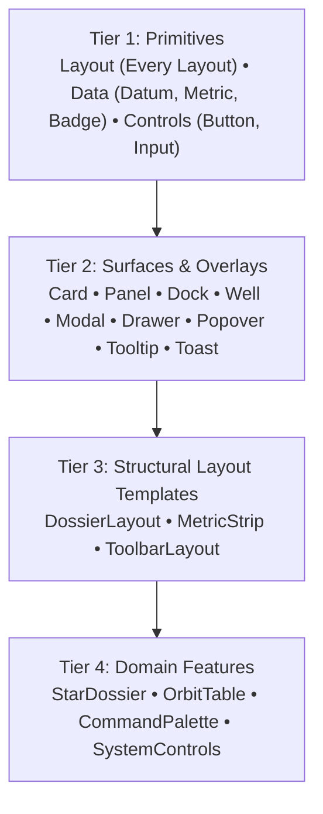

# Starmap Design System & Architecture Specification

This document defines the architectural foundations, spatial hierarchies, design tokens, and component guidelines for Starmap. It serves as the single source of truth for frontend developers and contributors.

---

## 1. System Overview & Cartographic Philosophy

Starmap is a technical, high-density schematic tool for navigating astronomical data and 3D celestial environments. Its design language is inspired by technical telemetry consoles, cartographic surveys (such as the Ordnance Survey), and schematic transport maps (such as the London Underground map).

### Core Principles

1. **Schematic Map over Realistic Void:** The interface avoids pseudo-cinematic glows and dark void clichés. Space is presented as an organised, measured coordinate environment with precise typography and clear spatial planes.
2. **Strict Color Channel Separation:**
   - **Achromatic Text & Surfaces:** All typography, reading prose, container panels, and table structures operate on a high-contrast neutral axis. Text never borrows chromatic hues from data categories.
   - **Reserved Interactive Focus:** Vibrant chromatic cyan/blue (`--state-focus`) is strictly reserved for user tracking, active waypoints, and keyboard `:focus-visible` states.
   - **Scientific Indicators:** Chromatic hues (green, yellow, red, violet) are restricted strictly to telemetry status (`--status-*`), observational confidence (`--confidence-*`), and astronomical domains (`--category-*`).
   - **Neutral Cartographic Chrome:** Grids, range circles, reticles, and coordinate axes are rendered in neutral lines so they never compete with thematic star data.
3. **Themed Solarized Palette in OKLCH:** Initial color literals are derived from Ethan Schoonover’s canonical Solarized palette, mapped in the perceptually uniform **OKLCH** color space to guarantee predictable lightness, uniform contrast, and clean alpha blending.
4. **Pure Orthogonal Geometry:** All surfaces, containers, buttons, and inputs default to `--radius-none` (`0px`), creating a sharp, high-precision aesthetic.

---

## 2. Token Architecture & The 3-Tier Pipeline

Tokens are structured into a 3-tier pipeline that decouples raw mathematical measurements from UI intent and component implementations:



### 1. Literal Layer (`src/styles/tokens/literal.css`)
Contains pure scales, units, and swatches with zero domain or UI meaning:
- **Palette Swatches:** Canonical Solarized neutral and chromatic coordinates in OKLCH.
- **Mathematical Scales:** Computed dynamically via CSS `calc()`.
- **Naming Pattern:** `--[scale-type]-[dimension]-[step]` (e.g. `--palette-solarized-base02`, `--type-scale-1`, `--space-fib-4`, `--stroke-width-1`, `--opacity-85`).

### 2. Semantic Layer (`src/styles/tokens/semantic.css`)
Maps literal values to UI roles, spatial tiers, and domain meaning. **This is the boundary where Dark and Light themes diverge:**
- Changing a theme remaps semantic tokens to different literal swatches; component styles remain untouched.
- Standardized property suffixes are used uniformly across all categories: `-bg`, `-color`, `-width`, `-style`, `-shadow`, `-opacity`, `-backdrop-blur`, `-size`, `-tracking`, `-transform`, `-leading`.
- **Naming Pattern:** `--[category]-[target]-[property]` (e.g. `--surface-panel-bg`, `--text-content-hero-title-size`, `--space-inset-card`, `--chrome-range-ring-color`).

### 3. Component Layer (Local Token Interface)
Components declare localized CSS variables at the top of their CSS Module rules. Components consume **only** Semantic tokens, never Literal tokens.

### CSS Cascading Layers (`src/styles/layers.css`)
Global specificity is governed by CSS Cascading Layers declared at the application root:
```css
@layer reset, tokens, composition, blocks, exceptions, utilities;
```
1. **`reset`:** Browser normalisation, box-sizing, and body baseline rules.
2. **`tokens`:** Literal and semantic CSS variable declarations.
3. **`composition`:** Layout primitives (`<Stack>`, `<Cluster>`, `<Grid>`), controlling only external spatial flow.
4. **`blocks`:** Scoped component styles (CSS Modules), controlling internal aesthetics.
5. **`exceptions`:** State and variant modifiers (`[data-status]`, `[data-confidence]`). Sits above `blocks` so attribute overrides take precedence without specificity escalation.
6. **`utilities`:** Single-purpose helper classes (`.u-visually-hidden`), allowed to override block defaults when explicitly applied.

---

## 3. Spatial Surface Hierarchy

The viewport comprises an 8-tier stack of semantic container planes anchored above the 3D WebGL canvas:



### The Composite Surface Contract
Every surface tier obeys a composite profile formula:
$$\text{Surface Profile} = \text{Fill} + \text{Border Treatment} + \text{Elevation Shadow} + \text{Optics}$$

To prevent coupling and permit independent visual tuning, **each tier defines its own dedicated semantic properties**:
- Background: `--surface-<tier>-bg`
- Border Width: `--surface-<tier>-border-width`
- Border Color: `--surface-<tier>-border-color`
- Border Style: `--surface-<tier>-border-style`
- Shadow: `--surface-<tier>-shadow`
- Opacity: `--surface-<tier>-opacity`
- Backdrop Blur: `--surface-<tier>-backdrop-blur`
- Stacking: `--z-<tier>`

### Search & Command Palette Modal Paradigm
Search operates at the **Modal** tier (`--surface-modal`) as a unified Command Palette (`<CommandPalette>`), invoked from the dock search pill. This isolates dense search and coordinate queries from underlying viewport interactions and traps keyboard focus cleanly.

---

## 4. Mathematical Systems & Conventions

### 1. Modular Typography: Major Third (1.250)
Type scale steps are derived mathematically from a base of `1rem` (`16px`) via CSS `calc()`. Adjusting `--type-ratio` in the literal layer dynamically recalculates the entire scale:
- Decreasing steps: `--type-scale-neg-2` (~`10.2px`), `--type-scale-neg-1` (`12.8px`)
- Baseline step: `--type-scale-0` (`16.0px`)
- Increasing steps: `--type-scale-1` (`20.0px`), `--type-scale-2` (`25.0px`), `--type-scale-3` (~`31.3px`), `--type-scale-4` (~`39.1px`)

Semantic typography is classified across three dedicated application domains:
1. **The 3D Map Itself (`--text-map-*`):** Celestial nodes (`system`, `planet`, `satellite`, `phenomenon`, `structure`, `vehicle`) and cartographic labels (`region`, `scale`, `coordinate`, `annotation`).
2. **Data Content (`--text-content-*`):** Headers (`hero-title`, `subtitle`, `section-title`, `eyebrow`), telemetry metrics (`metric-value`, `metric-unit`, `data-label`, `data-value`, `uncertainty`), prose (`body-lead`, `body`), and catalog metadata (`badge`, `catalog-id`, `footnote`).
3. **UI Chrome (`--text-ui-*`):** Navigation (`nav-tab`, `breadcrumb`, `breadcrumb-active`), search (`search-input`, `search-placeholder`, `search-shortcut`), buttons (`button-prominent`, `button-default`, `button-subtle`), and controls (`input`, `modal-title`, `tooltip`, `toast-*`).

### 2. Spacing: Pure Additive Fibonacci Sequence
Spacing follows the Fibonacci sequence ($a + b = c$) derived dynamically via `calc()`, guaranteeing harmonious optical proportions:
- `--space-fib-1` (`3px`), `--space-fib-2` (`5px`), `--space-fib-3` (`8px`), `--space-fib-4` (`13px`), `--space-fib-5` (`21px`), `--space-fib-6` (`34px`), `--space-fib-7` (`55px`).

Semantic spacing maps these steps into four layout categories:
- **Insets:** `--space-inset-card`, `--space-inset-panel`, `--space-inset-control-x/y`, `--space-inset-cell-x/y`, `--space-inset-badge`.
- **Stack Gaps:** `--space-stack-dense` (paired label/value), `--space-stack-control` (form fields), `--space-stack-default` (paragraphs), `--space-stack-section` (major dividers).
- **Cluster Gaps:** `--space-cluster-dense` (badge lists), `--space-cluster-default` (buttons), `--space-cluster-loose` (nav tabs).
- **Layout Gutters:** `--space-grid-gap` (card grids), `--space-viewport-edge` (screen margins).

### 3. Symmetrical Opacity & Backdrop Blur Pairs
To support translucent and glassmorphism themes without stylesheet refactoring, every opacity token is paired symmetrically with a backdrop blur token:
- Surfaces: `--surface-<tier>-opacity` paired with `--surface-<tier>-backdrop-blur`.
- Controls: `--ui-<element>-opacity` paired with `--ui-<element>-backdrop-blur`.
- Values obey standard CSS direction: `0` = completely transparent, `1.0` = completely solid.

### 4. Technical Motion & Accessibility
- **Durations:** Discrete steps for feedback (`--motion-duration-feedback: 75ms`), interactions (`--motion-duration-interactive: 150ms`), overlays (`--motion-duration-overlay: 250ms`), and spatial transitions (`--motion-duration-spatial: 400ms`).
- **Easings:** Snappy technical deceleration (`--motion-ease-default: cubic-bezier(0.2, 0, 0, 1)`).
- **Reduced Motion:** When `@media (prefers-reduced-motion: reduce)` is active, all durations clamp to `0ms` automatically at the root.

---

## 5. Component Taxonomy

Starmap enforces a 4-tier component taxonomy. Developers must assemble views strictly following this hierarchy:



### Tier 1: Primitives (Base Elements)
Atomic, domain-agnostic elements with no knowledge of stars, orbits, or application state.
- **Layout Primitives (Every Layout):** Manage spatial rhythm and wrapping without media queries.
  - `<Stack>`: Vertical flow with uniform gap between siblings.
  - `<Cluster>`: Inline flex wrap with uniform gap; children maintain intrinsic size.
  - `<Sidebar>`: Two-column layout pairing a fixed/intrinsic sidebar with a fluid content area.
  - `<Switcher>`: Switches children from horizontal row to vertical stack below a container threshold.
  - `<Grid>`: Responsive auto-fit CSS grid (`repeat(auto-fit, minmax(var(--min), 1fr))`).
  - `<Center>`: Horizontally centred container with `max-inline-size` and gutter padding.
  - `<Cover>`: Minimum 100% block-height container centring a principal element with optional header/footer.
  - `<Frame>`: Aspect-ratio locked container (`aspect-ratio: var(--ratio)`) for previews and reticles.
  - `<Reel>`: Horizontal scroll container with scroll snap points.
  - `<Box>`: Foundational wrapper providing token-driven padding, border, and background slots.
  - `<Imposter>`: Absolute/fixed overlay anchored to a container or viewport.
  - `<Icon>`: Inline $1\text{em} \times 1\text{em}$ container aligning SVGs with adjacent typography.
- **Data Primitives:**
  - `<Datum>`: Horizontal key-value row for dense parameter listings (e.g. `Mass: 1.04 M☉`).
  - `<Metric>`: Hero data tile displaying a large stacked value and unit for glanceable summary dashboards.
  - `<Badge>`: Status, confidence, or category metadata chip.
- **Control Primitives:** `<Button>`, `<Input>`, `<Toggle>`, `<Slider>`, `<Select>`.

### Tier 2: Surfaces & Overlays (Spatial Planes)
Containers that implement Tier profiles (fill, border, shadow, elevation, and optics):
- Surfaces: `<Card>` (`--surface-panel`), `<Panel>` (`--surface-panel`), `<Dock>` (`--surface-dock`), `<Well>` (`--surface-inset`).
- Overlays: `<Modal>` (`--surface-modal`), `<Drawer>` (`--surface-drawer`), `<Popover>` (`--surface-popover`), `<Tooltip>` (`--surface-popover`), `<Toast>` (`--surface-toast`).

### Tier 3: Structural Layout Templates (Reusable Wireframes)
Domain-agnostic layouts composed of Tier 1 primitives and Tier 2 surfaces. They provide internal layout slots without binding to any specific astronomical model:
- `<DossierLayout>`: Standard wireframe providing a hero header slot, summary metric cluster, tabular data stack, and action footer.
- `<MetricStrip>`: Responsive horizontal switcher or grid holding 3–5 `<Metric>` tiles.
- `<ToolbarLayout>`: Arranges navigation tabs, active filters, and auxiliary action clusters.

### Tier 4: Domain Features (Application Assemblies)
Starmap-specific components that bind live data and application state to Tier 3 templates and Tier 2 surfaces:
- `<StarDossier>`: Renders spectral class, luminosity, habitable zone boundaries, and exoplanet inventory.
- `<OrbitTable>`: Tabular telemetry of Keplerian orbital elements (semi-major axis, eccentricity, inclination).
- `<CommandPalette>`: Modal search interface for celestial entities and galactic coordinates.
- `<SystemControls>`: HUD-pinned controls for time scrubbing, orbit projection toggles, and coordinate grids.

---

## 6. Developer Guidelines & Architectural Guardrails

### Guardrail 1: The "No Outer Margins" Rule (Composition First)
**Blocks MUST NEVER set outer margins, outer layout positioning, or floats.**
- External spacing between components is strictly owned by Composition Primitives (`<Stack gap="...">`, `<Cluster gap="...">`).
- If a component needs space around it, wrap it in a `<Stack>` or `<Box padding="...">`.

```tsx
/* BAD: Card manages its own margin */
<Card style={{ marginBottom: '20px' }} />

/* GOOD: Layout primitive owns the spatial rhythm */
<Stack gap="space-stack-default">
  <Card />
  <Card />
</Stack>
```

### Guardrail 2: The Local Token Interface Pattern
Every UI block’s CSS Module must declare component-scoped CSS variables at the top of its root class selector, mapping semantic design tokens to local variables:

```css
/* Card.module.css */
@layer blocks {
  .card {
    /* 1. Local Token Interface */
    --card-bg:           var(--surface-panel-bg);
    --card-border-color: var(--surface-panel-border-color);
    --card-border-width: var(--surface-panel-border-width);
    --card-border-style: var(--surface-panel-border-style);
    --card-shadow:       var(--surface-panel-shadow);
    --card-padding:      var(--space-inset-card);

    /* 2. Structural Declarations */
    background:   var(--card-bg);
    border:       var(--card-border-width) var(--card-border-style) var(--card-border-color);
    box-shadow:   var(--card-shadow);
    padding:      var(--card-padding);
  }
}
```

### Guardrail 3: CUBE Exceptions via HTML `data-*` Attributes
State variants, confidence indicators, and category themes are driven strictly by HTML `data-*` attributes and ARIA states, **never** by class-name concatenation:
- React components forward semantic props directly to HTML data attributes (`status="critical"` renders `data-status="critical"`).
- In CSS, exceptions mutate the **Local Token Interface**, adhering to the Single-Aspect Override Rule:

```css
/* Card.module.css */
@layer exceptions {
  /* Mutate the local token, never the CSS property directly */
  .card[data-status="critical"] {
    --card-border-color: var(--status-critical);
  }

  .card[data-status="caution"] {
    --card-border-color: var(--status-caution);
  }
}
```

### Guardrail 4: Single-Aspect Override Rule
When applying status, category, or confidence semantics, components override only a single aspect at a time (e.g. `border-color`), preserving the structural tokens governing width, style, and baseline geometry.

---

## 7. Step-by-Step Component Implementation Recipe

When creating a new UI component in Starmap, follow this strict recipe:

### 1. Component TypeScript Definition
```tsx
// src/components/primitives/Datum/Datum.tsx
import React from 'react';
import styles from './Datum.module.css';

export interface DatumProps {
  label: string;
  value: string | number;
  unit?: string;
  status?: 'nominal' | 'caution' | 'critical';
}

export const Datum: React.FC<DatumProps> = ({ label, value, unit, status }) => {
  return (
    <div className={styles.datum} data-status={status}>
      <span className={styles.label}>{label}</span>
      <span className={styles.valueGroup}>
        <span className={styles.value}>{value}</span>
        {unit && <span className={styles.unit}>{unit}</span>}
      </span>
    </div>
  );
};
```

### 2. Component CSS Module
```css
/* src/components/primitives/Datum/Datum.module.css */
@layer blocks {
  .datum {
    /* 1. Local Token Interface */
    --datum-padding-y:    var(--space-inset-cell-y);
    --datum-padding-x:    var(--space-inset-cell-x);
    --datum-border-color: var(--border-color-subtle);
    --datum-border-width: var(--border-width-subtle);
    --datum-border-style: var(--border-style-boundary);

    display: flex;
    justify-content: space-between;
    align-items: baseline;
    padding: var(--datum-padding-y) var(--datum-padding-x);
    border-bottom: var(--datum-border-width) var(--datum-border-style) var(--datum-border-color);
  }

  .label {
    font-family: var(--font-interface);
    font-size:   var(--text-content-data-label-size);
    color:       var(--content-default);
  }

  .valueGroup {
    display: inline-flex;
    gap:     var(--space-cluster-dense);
    align-items: baseline;
  }

  .value {
    font-family: var(--font-data);
    font-size:   var(--text-content-data-value-size);
    color:       var(--content-prominent);
    font-variant-numeric: tabular-nums;
  }

  .unit {
    font-family: var(--font-data);
    font-size:   var(--text-content-metric-unit-size);
    color:       var(--content-muted);
  }
}

@layer exceptions {
  .datum[data-status="critical"] {
    --datum-border-color: var(--status-critical);
  }
}
```

---

## 8. Contributor Checklist (Before Submitting PRs)

Before opening any PR involving UI or styling, verify the following:
- [ ] **Zero Magic Numbers:** No hardcoded hex values (`#fff`), pixel spacing (`margin: 12px`), or arbitrary font sizes. Everything consumes `var(--token)`.
- [ ] **No Outer Margins:** Component CSS sets zero outer `margin`. Spacing is managed by `<Stack>`, `<Cluster>`, or `<Box>`.
- [ ] **Layers Enforced:** Component styles are wrapped in `@layer blocks { ... }` and exceptions in `@layer exceptions { ... }`.
- [ ] **Local Token Interface:** Custom properties are declared at the top of the component block and mutated by exceptions.
- [ ] **Semantic Props to Data Attributes:** Variants and states are bound to HTML `data-*` attributes, not class concatenation.
- [ ] **Tabular Numerals:** All numeric telemetry uses `var(--font-data)` and `font-variant-numeric: tabular-nums`.
- [ ] **Quality Suite Clean:** `npm run lint`, `npm run typecheck`, and `npm run test:coverage` pass with zero errors.
