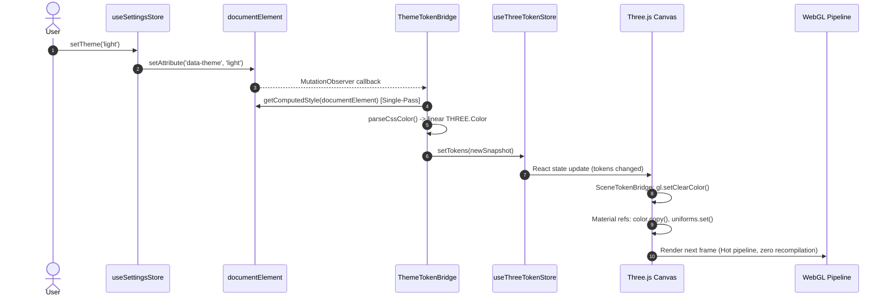

# Three.js Token Synchronisation Architecture

This document specifies the technical architecture for reading CSS custom properties (design tokens) from the DOM and synchronising them into WebGL/Three.js materials, custom shader uniforms, and scene lighting.

---

## 1. Architectural Objectives & Constraints

The Starmap interface pairs a 2D DOM layout (HTML/CSS design system) with a 3D WebGL viewport. Maintaining complete visual harmony across Light and Dark themes requires passing design tokens into the GPU pipeline under strict performance constraints.

```
┌─────────────────────────┐          ┌───────────────────────────┐
│     DOM & CSS Tokens    │          │     WebGL / Three.js      │
│  (:root, [data-theme])  │          │  (Materials, Shaders, gl) │
└────────────┬────────────┘          └─────────────▲─────────────┘
             │                                     │
             │   1. Theme Event / Mutation         │  4. In-Place Uniform
             ▼                                     │     Mutation (0ms)
┌─────────────────────────┐          ┌─────────────┴─────────────┐
│    ThemeTokenBridge     │─────────►│    useThreeTokenStore     │
│  (Single-Pass DOM Read) │  2. Parse│   (Immutable Snapshot)    │
└─────────────────────────┘     & Set└───────────────────────────┘
```

### Core Constraints
1. **Zero Layout Thrashing (60fps Budget):**
   `window.getComputedStyle()` forces a synchronous browser reflow. It is **strictly forbidden** to invoke `getComputedStyle` within `useFrame`, `requestAnimationFrame`, or any render loop. Tokens are read **strictly once per theme change event**.
2. **Zero Shader Recompilation:**
   Toggling themes must **never** dispose of and recreate Three.js materials (e.g. changing React `key={theme}`). Material reconstruction causes WebGL pipeline stalls while shaders recompile and bind. Theme transitions must execute via **in-place uniform and property mutations**.
3. **Color Space Accuracy:**
   CSS colors are authored in modern OKLCH and sRGB hex/alpha tokens. Three.js operates in a linear working color space (`THREE.SRGBColorSpace` with `THREE.ColorManagement.enabled = true`). All color tokens must be converted into linear `THREE.Color` instances during parsing.
4. **Sub-Frame Reactivity:**
   The DOM and the WebGL canvas must transition simultaneously. Theme changes must resolve within a single frame to eliminate visual flickering or desynchronisation between 2D UI panels and 3D celestial nodes.

---

## 2. Token Mapping Schema

The bridge extracts a defined subset of semantic tokens from `src/styles/tokens/semantic.css` and maps them into strongly typed Three.js primitives:

```typescript
export interface ThreeTokenSnapshot {
  // Surface & Canvas Environment
  canvasBg: THREE.Color;
  canvasOpacity: number;

  // Cartographic Graticules & Range Rings
  gridPrimaryColor: THREE.Color;
  gridPrimaryAlpha: number;
  gridSecondaryColor: THREE.Color;
  gridSecondaryAlpha: number;
  rangeRingColor: THREE.Color;
  rangeRingAlpha: number;
  rangeTickColor: THREE.Color;
  rangeTickAlpha: number;

  // Tactical Reticles & Bearings
  reticleBracketColor: THREE.Color;
  reticleBracketAlpha: number;
  boresightColor: THREE.Color;
  boresightAlpha: number;
  axisLineColor: THREE.Color;
  axisLineAlpha: number;
  headingIndicatorColor: THREE.Color;
  headingIndicatorAlpha: number;

  // Interactive & State Cues
  stateFocus: THREE.Color;
  stateSelectedBorder: THREE.Color;
  stateHoverOverlayAlpha: number;

  // Domain Categories (Analytical Layers)
  categoryStar: THREE.Color;
  categoryPlanet: THREE.Color;
  categoryOrbit: THREE.Color;
  categoryHabitability: THREE.Color;

  // Telemetry & Confidence Status
  statusNominal: THREE.Color;
  statusCaution: THREE.Color;
  statusCritical: THREE.Color;
  confidenceConfirmed: THREE.Color;
  confidenceCandidate: THREE.Color;
  confidenceTheoretical: THREE.Color;

  // Active Theme Identifier
  theme: 'dark' | 'light' | 'amoled';
}
```

### Token Mapping Registry

| CSS Custom Property | Three.js Target Type | Usage Domain |
| :--- | :--- | :--- |
| `--surface-canvas-bg` | `THREE.Color` | WebGL Clear Color & Scene Background |
| `--surface-canvas-opacity` | `number` (0–1) | Clear Alpha (`gl.setClearColor`) |
| `--chrome-grid-primary-color` | `THREE.Color` + `alpha` | Galactic Equator datum major rings |
| `--chrome-grid-secondary-color` | `THREE.Color` + `alpha` | Subordinate graticules & travelling fins |
| `--chrome-range-ring-color` | `THREE.Color` + `alpha` | Metric distance range rings |
| `--chrome-range-tick-color` | `THREE.Color` + `alpha` | Fin curved perimeter degree ticks ($l, b$) |
| `--chrome-reticle-bracket-color` | `THREE.Color` + `alpha` | Universal reticle frames (diamonds, chevrons) |
| `--chrome-axis-line-color` | `THREE.Color` + `alpha` | Off-screen Core & Orbital bearing lines |
| `--chrome-heading-indicator-color`| `THREE.Color` + `alpha` | Detachable screen-edge bearing arrowheads |
| `--state-focus` | `THREE.Color` | Focused target reticle & drop stalk |
| `--state-selected-border` | `THREE.Color` | Selected waypoint & active inspection lock |
| `--category-star` | `THREE.Color` | Stellar analytical query highlight |
| `--category-planet` | `THREE.Color` | Exoplanet host query highlight |
| `--status-critical` | `THREE.Color` | Relativistic hazard indicator (`HAZARD`) |

---

## 3. Color Space & Parsing Mechanics

### 3.1 OKLCH to Linear sRGB Conversion
Starmap's design tokens use OKLCH color definitions (e.g. `oklch(64.37% 0.1019 187.38 / 0.15)`).

1. When queried via `getComputedStyle(element).getPropertyValue(token)`, modern browsers resolve OKLCH and CSS Color 4 functions into computed `rgb(r g b)` or `rgba(r, g, b, a)` strings.
2. In legacy or headless test environments (e.g. Vitest/jsdom), computed style queries may return raw `oklch(...)` strings. The parser must gracefully fall back to an internal color-string converter.

```typescript
export interface ParsedColorResult {
  color: THREE.Color;
  alpha: number;
}

/**
 * Parses any browser-computed CSS color string (hex, rgb, rgba, oklch)
 * into a linear THREE.Color and an alpha scalar.
 */
export function parseCssColor(cssColorString: string): ParsedColorResult {
  const trimmed = cssColorString.trim();

  // Match rgba(r, g, b, a) or rgb(r g b / a)
  const rgbaMatch = trimmed.match(
    /rgba?\(\s*([\d.]+)[,\s]+([\d.]+)[,\s]+([\d.]+)(?:[,\s/]+([\d.%]+))?\s*\)/i,
  );

  if (rgbaMatch) {
    const [, r, g, b, rawAlpha] = rgbaMatch;
    const color = new THREE.Color(
      Number(r) / 255,
      Number(g) / 255,
      Number(b) / 255,
    );
    // Convert to linear working space
    color.convertSRGBToLinear();

    let alpha = 1;
    if (rawAlpha !== undefined) {
      alpha = rawAlpha.endsWith('%')
        ? Number(rawAlpha.slice(0, -1)) / 100
        : Number(rawAlpha);
    }
    return { color, alpha };
  }

  // Standard CSS Color fallback (hex, named, or clean rgb)
  const color = new THREE.Color();
  color.set(trimmed);
  color.convertSRGBToLinear();
  return { color, alpha: 1 };
}
```

---

## 4. The Token Synchronisation Bridge (`SceneTokenBridge`)

The bridge operates as an event-driven synchronization engine. It decouples the DOM mutation lifecycle from the WebGL render loop.

### 4.1 Reactive Store Architecture
A lightweight Zustand store holds the immutable token snapshot:

```typescript
interface ThreeTokenState {
  tokens: ThreeTokenSnapshot;
  setTokens: (tokens: ThreeTokenSnapshot) => void;
}

export const useThreeTokenStore = create<ThreeTokenState>((set) => ({
  tokens: DEFAULT_DARK_TOKEN_SNAPSHOT,
  setTokens: (tokens) => set({ tokens }),
}));
```

### 4.2 Dual-Trigger Synchronization Hook
The bridge resolves tokens under two circumstances:
1. **Store Subscription:** Direct reaction when `useSettingsStore.theme` changes.
2. **DOM Mutation:** A `MutationObserver` on `document.documentElement` watching for `data-theme` and `class` changes to handle programmatic or external theme toggles.

```typescript
export function useThemeTokenSync(): void {
  const theme = useSettingsStore((state) => state.theme);
  const setTokens = useThreeTokenStore((state) => state.setTokens);

  const resolveTokens = useCallback(() => {
    // Single-pass DOM read: called ONLY on theme toggle
    const computed = window.getComputedStyle(document.documentElement);
    const snapshot = extractThreeTokens(computed, theme);
    setTokens(snapshot);
  }, [theme, setTokens]);

  useEffect(() => {
    // 1. Resolve immediately on mount or store theme change
    resolveTokens();

    // 2. Observe DOM mutations on documentElement (data-theme)
    const observer = new MutationObserver((mutations) => {
      for (const mutation of mutations) {
        if (
          mutation.type === 'attributes' &&
          (mutation.attributeName === 'data-theme' || mutation.attributeName === 'class')
        ) {
          resolveTokens();
          break;
        }
      }
    });

    observer.observe(document.documentElement, {
      attributes: true,
      attributeFilter: ['data-theme', 'class'],
    });

    return () => observer.disconnect();
  }, [resolveTokens]);
}
```

---

## 5. Material & Uniform Binding Patterns

### 5.1 In-Place Material Mutation (Standard Materials)
Standard Three.js materials (`LineBasicMaterial`, `MeshBasicMaterial`) update their existing properties in-place without triggering shader recompilation:

```typescript
export const RangeRingMesh: React.FC = () => {
  const materialRef = useRef<THREE.LineBasicMaterial>(null);
  const tokens = useThreeTokenStore((state) => state.tokens);

  useEffect(() => {
    if (!materialRef.current) return;

    // Mutate in place: 0ms cost, zero shader rebuild
    materialRef.current.color.copy(tokens.rangeRingColor);
    materialRef.current.opacity = tokens.rangeRingAlpha;
    materialRef.current.transparent = tokens.rangeRingAlpha < 1.0;
  }, [tokens.rangeRingColor, tokens.rangeRingAlpha]);

  return (
    <line>
      <lineBasicMaterial ref={materialRef} />
    </line>
  );
};
```

### 5.2 Custom Shader Uniform Binding (`ShaderMaterial`)
For custom shaders (e.g. cartographic stippling, travelling fin arcs, reticle shaders), uniforms maintain permanent object references. The bridge updates the vector values directly:

```typescript
export const TravellingFinShader: React.FC = () => {
  const uniforms = useMemo(
    () => ({
      uGridColor: { value: new THREE.Color() },
      uGridAlpha: { value: 1.0 },
      uTickColor: { value: new THREE.Color() },
      uTickAlpha: { value: 1.0 },
    }),
    [],
  );

  const tokens = useThreeTokenStore((state) => state.tokens);

  useEffect(() => {
    // Directly mutate uniform values
    uniforms.uGridColor.value.copy(tokens.gridSecondaryColor);
    uniforms.uGridAlpha.value = tokens.gridSecondaryAlpha;
    uniforms.uTickColor.value.copy(tokens.rangeTickColor);
    uniforms.uTickAlpha.value = tokens.rangeTickAlpha;
  }, [tokens, uniforms]);

  return <shaderMaterial uniforms={uniforms} /* ... */ />;
};
```

### 5.3 WebGL Viewport Clear & Environment Sync
The canvas background and clear color synchronize inside the `<Canvas>` via a dedicated `<SceneTokenBridge>` component:

```typescript
export const SceneTokenBridge: React.FC = () => {
  const { gl, scene } = useThree();
  const tokens = useThreeTokenStore((state) => state.tokens);

  useEffect(() => {
    // Update WebGL clear color to match --surface-canvas-bg
    gl.setClearColor(tokens.canvasBg, tokens.canvasOpacity);
    scene.background = tokens.canvasOpacity > 0 ? tokens.canvasBg : null;
  }, [gl, scene, tokens.canvasBg, tokens.canvasOpacity]);

  return null;
};
```

---

## 6. Reactivity & Render Lifecycle

### 6.1 Theme Toggle Execution Sequence



### 6.2 Life-Cycle Safety & Memory Management
* **No Leaked Observers:** The `MutationObserver` disconnects cleanly upon unmount of the root provider.
* **Stable Uniform References:** `useMemo` ensures uniform dictionaries are never re-instantiated across component re-renders.
* **Canvas Remount Isolation:** The token store exists outside the React-Three-Fiber tree, ensuring that if `<Canvas>` unmounts during route transitions, the active token cache persists instantly without a cold-start read.

---

## 7. Performance Guardrails & Architectural Invariants

| Rule | Enforcement Mechanism | Failure Mode Prevented |
| :--- | :--- | :--- |
| **No `getComputedStyle` in tick loops** | Static analysis & code-review checks | Browser layout thrashing; 60fps frame drops |
| **No dynamic `key={theme}` on Canvas/Materials** | Strict code review & ESLint conventions | WebGL shader recompilation pipeline stalls |
| **Linear Color Conversion** | `parseCssColor()` pipeline | Color washed out / double-gamma distortion |
| **Single-Pass DOM Read** | Batch extraction in `extractThreeTokens()` | Multiple layout recalculations per theme event |
| **Immutable Token Snapshot** | Zustand store with object replacement | Deep mutation race conditions in components |
