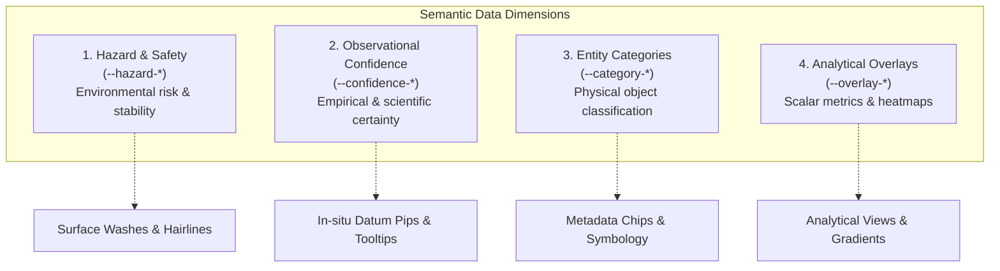

# UI Visual Language & Token Semantics Specification

This document specifies Starmap's 2D user interface visual language, semantic token relationships, tabular data presentation rules, and component-level CUBE exception architecture.

All specifications are defined strictly at the **semantic layer**, decoupling UI intent, roles, and structural mechanics from raw literal palette swatches and arbitrary implementation values.

---

## 1. Architectural Philosophy & Channel Separation

Starmap is a high-density, technical telemetry console for navigating astronomical data and 3D celestial environments. To ensure effortless legibility across complex multi-body systems without cognitive fatigue, the interface enforces a strict separation of visual channels:

```
┌────────────────────────────────────────────────────────────────────────┐
│                        STRICT CHANNEL SEPARATION                       │
├──────────────────────────┬──────────────────────┬──────────────────────┤
│    Achromatic Neutral    │   Reserved Focus     │ Scientific Indicators│
│      Reading Plane       │     Interaction      │ & Analytical Layers  │
├──────────────────────────┼──────────────────────┼──────────────────────┤
│ • Typography & labels    │ • Active waypoints   │ • Hazard condition   │
│ • Container surfaces     │ • Target reticles    │ • Observational cert.│
│ • Monospace telemetry    │ • Keyboard focus     │ • Entity categories  │
│ • Hairline grid rules    │ • Scrubhead needles  │ • Analytical overlays│
│ (--content-*,            │ (--state-focus)      │ (--hazard-*,         │
│  --surface-*)            │                      │  --confidence-*,     │
│                          │                      │  --category-*,       │
│                          │                      │  --overlay-*)        │
└──────────────────────────┴──────────────────────┴──────────────────────┘
```

### Core Axioms
1. **Achromatic Neutral Reading Plane:**
   All typography, numerical metrics, structural container backgrounds, and tabular boundaries operate strictly on the semantic neutral contrast axis (`--content-*`, `--surface-*`). Reading text and structural chrome never borrow chromatic hues from data categories or status channels.
2. **Reserved Interactive Focus:**
   The interactive focus token (`--state-focus`) is strictly reserved for user navigation: active waypoints, camera focal reticles, active navigation indicators, and keyboard `:focus-visible` rings. It is never used for decorative badges, status chips, or passive data labels.
3. **Decoupled Scientific Channels:**
   Chromatic channels are strictly restricted to four orthogonal scientific dimensions:
   - **Hazard & Environmental Safety (`--hazard-*`)**
   - **Observational Confidence (`--confidence-*`)**
   - **Entity Categories (`--category-*`)**
   - **Analytical Overlays (`--overlay-*`)**
4. **Pure Orthogonal Geometry:**
   Containers, panels, cards, buttons, badges, and input controls maintain `--radius-none` (`0px`) with sharp $90^\circ$ corners.
5. **Global 4-Tier Interaction State Taxonomy:**
   All entities, reticles, and interactive surfaces across 3D and 2D views strictly adhere to four universal interaction tiers:
   - `passive`: Baseline background entity, minimal unreticled dot or neutral element.
   - `active`: Within interactive scope or volume; basic reticle or row highlight present.
   - `selected`: Full decorated reticle applied (hover, click, or list selection may apply this state).
   - `focused`: Top-level prominence; accented with `--state-focus`, camera focal lock, and telemetry container engagement.


---

## 2. The Scientific Semantic Taxonomy



---

### 2.1 Hazard & Environmental Safety (`--hazard-*`)

Reframed from generic "status" to communicate environmental hazard, radiation levels, orbital stability, and gravitational risk.

| Semantic Token | Semantic Intent | Visual Manifestation on Containers |
| :--- | :--- | :--- |
| `--hazard-nominal` | Benign environment, stable orbit, safe radiation baseline. | **Neutral Baseline:** Achromatic chrome. Zero chromatic border, zero surface wash. Prevents visual fatigue. |
| `--hazard-caution` | Elevated hazard (e.g. high eccentricity, tidal heating, flare risk). | Subtle caution hairline border paired with a faint caution surface wash token (`--hazard-caution-surface`). |
| `--hazard-critical`| Extreme hazard (e.g. relativistic beam, Roche limit breach, lethal flare). | Critical hairline border paired with a distinct critical surface wash token (`--hazard-critical-surface`). |

#### Rules:
- **Quiet Baseline:** Nominal is the expected baseline and must remain completely neutral. Never flood healthy systems with chromatic green.
- **Surface Washes:** Applied via dedicated semantic surface tokens (`--hazard-*-surface`), never arbitrary opacity hacks.

---

### 2.2 Observational Confidence (`--confidence-*`)

Quantifies the empirical certainty of an astronomical detection or parameter calculation.

Confidence data exists in distinct scientific pockets within the catalog:
- **Exoplanets:** Validation status (`confirmed`, `candidate`, `controversial`).
- **Astrometry:** Astrometric quality (Gaia RUWE, parallax error margins).
- **Small Bodies:** Orbital condition codes (JPL $U$-values).

#### Visual Representation: Dedicated Datum Pip
Rather than applying heavy stroke styling across entire objects, observational confidence is rendered as a **dedicated indicator pip** (a small indicator dot) placed directly alongside the specific datum in question, paired with a contextual tooltip explaining the confidence tier and source catalog:

```
[ Proxima Centauri b ]  (•) ──► Tooltip: "Confirmed Exoplanet (RV + Transit Consensus)"
[ Semi-Major Axis    ]  0.0485 AU
[ Eccentricity       ]  0.1090 (•) ──► Tooltip: "Candidate Orbit: High Uncertainty (U=6)"
```

| Semantic Token | Epistemic Meaning |
| :--- | :--- |
| `--confidence-confirmed` | Independently verified detection; multi-instrument consensus. |
| `--confidence-candidate` | Single-instrument detection; threshold crossing event pending validation. |
| `--confidence-theoretical` | Mathematically modelled or dynamically inferred entity / parameter. |

---

### 2.3 Entity Categories (`--category-*`)

Broad classification of physical objects. Granular differences within a category (e.g. main sequence star vs giant, or terrestrial planet vs gas giant) are resolved via **symbology and reticle geometry**, keeping the chromatic palette concise.

| Semantic Token | Scope of Physical Entities |
| :--- | :--- |
| `--category-stellar` | Single stars, multiple stellar systems, barycentres, brown dwarfs. |
| `--category-planetary` | Major exoplanets and planets (terrestrial, gas giants, ice giants). |
| `--category-minor-body` | Moons, dwarf planets, asteroids, comets, trojans. |
| `--category-artificial` | Orbital stations, outposts, beacons, communications relays, vessels. |
| `--category-deep-sky` | Nebulae, star clusters, interstellar clouds, degenerate remnants (white dwarfs, neutron stars, black holes). |

---

### 2.4 Analytical Overlays (`--overlay-*`)

Scalar layers and heatmap projections across the celestial environment, strictly decoupled from entity taxonomy:

| Semantic Token | Analytical Focus |
| :--- | :--- |
| `--overlay-luminosity` | Visual magnitude, absolute brightness, stellar luminosity bands. |
| `--overlay-temperature` | Effective surface temperature ($T_{\text{eff}}$), thermal bands. |
| `--overlay-velocity` | Proper motion, space velocity vectors, radial drift. |
| `--overlay-habitability`| Circumstellar habitable zone (CHZ) flux, Earth Similarity Index (ESI). |

---

## 3. Tabular Data Presentation & Monospace Alignments

Astronomical telemetry demands high data density, absolute alignment rigor, and instant scanability.

### 3.1 Dual-Font Typographic Architecture

1. **Numerical Telemetry (`--font-data`):**
   - Consumes the semantic monospace role with `font-variant-numeric: tabular-nums`.
   - Forces identical horizontal advance widths across all digits (0–9), decimal points, and signs.
   - Guarantees strict vertical digit alignment down columns and eliminates layout jitter during live telemetry updates.
2. **Interface & Prose (`--font-interface`):**
   - Consumes the semantic proportional interface role for column headers, entity labels, and notes.

---

### 3.2 Column Alignment Principles

| Content Type | Text Alignment | Justification |
| :--- | :--- | :--- |
| **Entity Names & Designations** | `text-align: start` (Left) | Natural reading flow for text identifiers. |
| **Numeric Telemetry & Coordinates** | `text-align: end` (Right) | Rigorous vertical decimal and magnitude alignment. |
| **Status / Hazard Indicators** | `text-align: center` or `start` | Dedicated column with self-contained indicator. |

---

### 3.3 Universal Unit Consistency

Whenever a physical unit is rendered—whether inline in a cell, next to a hero metric, or **inside a column header**—it MUST ALWAYS be styled as a unit:
- Uses the semantic unit typography token (`--text-content-metric-unit-*`).
- Uses the semantic muted contrast token (`--content-muted`).
- Isolated from parent header or cell styles.

```html
<!-- Table Header Example -->
<th scope="col" class={styles.headerCell}>
  <span class={styles.headerLabel}>Semi-Major Axis</span>
  <span class={styles.headerUnit}>(AU)</span>
</th>
```

---

### 3.4 Missing, Incomplete, and Anomalous Values

When a sensor parameter or catalog field is unavailable:
- **Authoritative Standard:** Render the **Em Dash** (`—` / `\u2014`).
- **Styling:** Monospace, `--content-muted`, inheriting column alignment (`text-align: end`).
- **Strictly Banned:** `N/A`, `null`, `undefined`, `NaN`, `-1`, or blank cells.

---

### 3.5 Measurement Uncertainties

Astronomical parameters are empirical measurements subject to observational error ($V \pm \sigma$):
- Rendered inline directly alongside the value.
- The base value consumes `--content-prominent` and `--font-data`.
- The uncertainty ($\pm \sigma$) consumes the dedicated semantic uncertainty token (`--text-content-uncertainty-*`) and `--content-muted`.

```html
<td class={styles.cell}>
  <span class={styles.value}>1.042</span>
  <span class={styles.uncertainty}>±0.015</span>
</td>
```

---

## 4. Component-Level CUBE Exception Architecture

Starmap enforces CUBE CSS (Composition, Utility, Block, Exception) governed by CSS Cascading Layers (`@layer`).

### 4.1 What Qualifies as an Exception

An **Exception** is strictly a **state or contextual deviation from a component's neutral baseline**, hooked via an HTML `data-*` attribute to mutate its Local Token Interface.

Valid exceptions are restricted to three categories:
1. **Hazard / Condition Exceptions:**
   `data-hazard="caution"`, `data-hazard="critical"`
2. **Interactive & State Exceptions:**
   `data-state="passive" | "active" | "selected" | "focused"`, `data-pinned="true"`
3. **Category & Overlay Exceptions:**
   `data-category="stellar"`, `data-category="deep-sky"`, `data-overlay="luminosity"`

#### What is NOT an Exception:
- **Layout & Spacing:** Margin, padding between elements, and wrapping are 100% owned by Composition Primitives (`<Stack>`, `<Cluster>`, `<Grid>`).
- **Base Aesthetics:** The un-deviated look is owned by the Block definition in `@layer blocks`.
- **Single-Purpose Helpers:** Screen-reader text is owned by `@layer utilities`.

---

### 4.2 Cascading Layers Specificity Engine

Cascading layer order is declared globally in `src/styles/layers.css`:

```css
@layer reset, tokens, composition, blocks, exceptions, utilities;
```

Because `@layer exceptions` sits immediately after `@layer blocks`, attribute selectors inside `@layer exceptions` naturally override base block styles **without specificity escalation, chained classes, or `!important`**.

---

### 4.3 The Local Token Interface Pattern & Single-Aspect Rule

1. **Zero Dynamic Class Concatenation:**
   Components never concatenate class names for state (banned: `styles.card + ' ' + styles.isCritical`). All variants hook to HTML `data-*` attributes.
2. **Local Token Interface:**
   The block declares component-scoped CSS variables at its root. Structural properties consume only these local variables.
3. **Single-Aspect Override:**
   Exceptions mutate only the specific local variable representing that state, preserving structural layout, padding, and base geometry.

```css
/* Card.module.css */
@layer blocks {
  .card {
    /* Local Token Interface */
    --card-bg:           var(--surface-panel-bg);
    --card-border-color: var(--surface-panel-border-color);
    --card-border-width: var(--surface-panel-border-width);
    --card-border-style: var(--surface-panel-border-style);
    --card-padding:      var(--space-inset-card);

    /* Structural Declarations */
    background:    var(--card-bg);
    border:        var(--card-border-width) var(--card-border-style) var(--card-border-color);
    padding:       var(--card-padding);
    border-radius: var(--radius-none);
  }
}

@layer exceptions {
  /* Mutate only the local tokens */
  .card[data-hazard="caution"] {
    --card-border-color: var(--hazard-caution);
    --card-bg:           var(--hazard-caution-surface);
  }

  .card[data-hazard="critical"] {
    --card-border-color: var(--hazard-critical);
    --card-bg:           var(--hazard-critical-surface);
  }

  .card[data-interactive="true"]:hover {
    --card-border-color: var(--state-focus);
    cursor: pointer;
  }
}
```

---

## 5. Developer & Contributor Audit Checklist

Before submitting code reviews or opening pull requests involving UI components, verify conformance against these criteria:

- [ ] **Pure Semantic Abstraction:** Zero literal palette names (`--palette-*`, `Base0*`) or raw colour codes in component rules.
- [ ] **Quiet Baseline:** Nominal state has zero chromatic fill or border styling; it remains completely neutral.
- [ ] **No Class Concatenation:** Variants and states hook strictly to HTML `data-*` attributes.
- [ ] **Single-Aspect Overrides:** Exceptions mutate only localized CSS variables (`--<block>-*`) in `@layer exceptions`. Geometry, padding, and layout remain untouched.
- [ ] **Tabular Numerals & Monospace Font:** All numeric telemetry, coordinates, and orbital elements consume `--font-data` and `font-variant-numeric: tabular-nums`.
- [ ] **Universal Unit Styling:** Units (even when located inside table headers) strictly consume semantic unit typography (`--text-content-metric-unit-*`) and `--content-muted`.
- [ ] **Em Dash Fallback:** Missing or unmeasured fields render as `—` (`\u2014`). No `N/A`, `null`, or blank cells.
- [ ] **Inline Uncertainty:** Empirical measurement errors use inline $\pm \sigma$ with `--text-content-uncertainty-*`.
- [ ] **Pure Orthogonal Geometry:** All borders enforce `--radius-none` (`0px`).
